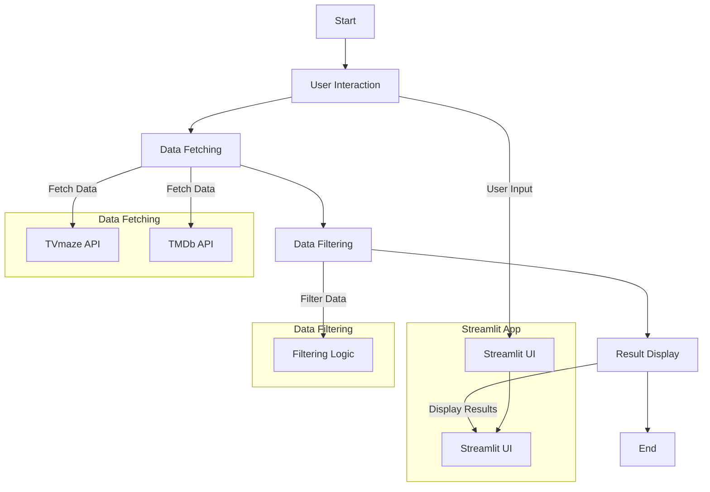
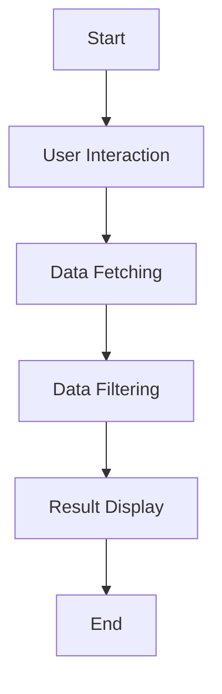
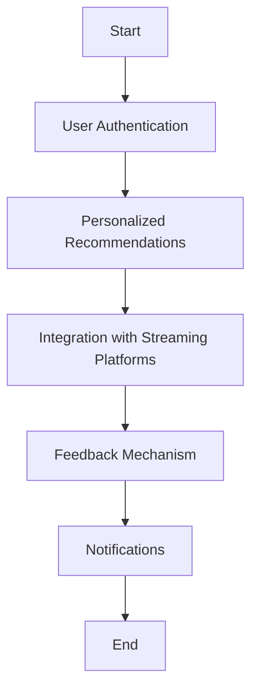

Based on the provided `StreamSage.py` file and the existing `README.md`, I'll outline a detailed program/project overview, objective, architecture, functions, operations, features, and process for the StreamSage project. This will serve as a foundation for creating an updated README.md file for your GitHub repository.

## Program/Project Overview

StreamSage is an interactive web application designed to recommend TV shows based on user preferences. It fetches real TV show data from the TVmaze and TMDb APIs, filters the shows based on the user's selected genre, language, duration, and rating, and displays the filtered results in an easy-to-navigate interface. The application aims to simplify the process of finding TV shows that match users' preferences, enhancing their viewing experience.

## Objective

The primary objective of StreamSage is to provide a personalized and user-friendly platform for discovering TV shows. By leveraging data from the TVmaze and TMDb APIs, StreamSage allows users to filter TV shows based on various criteria, including genre, language, duration, and rating. The goal is to make TV show selection more accessible and tailored to individual user preferences.

## Architecture

StreamSage is built using Streamlit, a popular framework for creating web applications for machine learning and data science projects. The application's architecture is designed to be modular, with separate components for data fetching, filtering, and display.

I apologize for the oversight. Let's create a more detailed architecture diagram for the StreamSage project, incorporating the components and interactions described in the overview.

## Architecture Diagram



This diagram illustrates the flow of operations within the StreamSage application, starting from user interaction through data fetching, filtering, and finally displaying the results. It highlights the key components involved in each step and how they interact with each other.

### Explanation of Components:

- **User Interaction**: This is where the user interacts with the Streamlit UI, selecting their preferences for genre, language, duration, and rating.
- **Data Fetching**: The application fetches TV show data from the TVmaze and TMDb APIs. This is represented by the `TVmaze API` and `TMDb API` nodes.
- **Data Filtering**: The fetched data is processed and filtered based on the user's selected criteria. This is encapsulated by the `Filtering Logic` node.
- **Result Display**: The filtered TV shows are displayed in the Streamlit UI, providing users with personalized recommendations.

This architecture diagram provides a visual representation of the StreamSage application's structure and the flow of data and operations within it.

### Components

- **Data Fetching**: Fetches TV show data from the TVmaze and TMDb APIs.
- **Data Filtering**: Filters the fetched data based on user-selected criteria.
- **Data Display**: Displays the filtered TV shows in an interactive and user-friendly interface.
- **User Interface**: Utilizes Streamlit's components to create an intuitive and responsive UI.

## Functions, Operations, and Features

### Functions

- **Fetch TV Show Data**: Retrieves TV show data from the TVmaze and TMDb APIs.
- **Filter TV Shows**: Filters the fetched data based on user-selected criteria such as genre, language, duration, and rating.
- **Display TV Shows**: Displays the filtered TV shows in an interactive and user-friendly interface.

### Operations

- **User Interaction**: Users interact with the application through the Streamlit interface, selecting their preferences for genre, language, duration, and rating.
- **Data Processing**: The application processes the user's selections and filters the TV show data accordingly.
- **Result Display**: The filtered TV shows are displayed in the application, providing users with personalized recommendations.

### Features

- **Interactive Filtering**: Users can filter TV shows based on various criteria, including genre, language, duration, and rating.
- **Personalized Recommendations**: Provides personalized TV show recommendations based on user preferences.
- **Responsive UI**: The application features a responsive and user-friendly interface, designed for ease of use.

## Process

1. **User Interaction**: Users interact with the application through the Streamlit interface, selecting their preferences for genre, language, duration, and rating.
2. **Data Fetching**: The application fetches TV show data from the TVmaze and TMDb APIs.
3. **Data Filtering**: The fetched data is filtered based on the user's selected criteria.
4. **Result Display**: The filtered TV shows are displayed in the application, providing users with personalized recommendations.

## Future Features and Enhancements

StreamSage aims to continuously improve and expand its functionality. Future enhancements include:

- **Modularized the Program**: Refactor the codebase to make it more modular, improving maintainability and scalability.
- **User Authentication**: Implement user authentication to allow users to create accounts and save their preferences.
- **User Profile Creation**: Allow users to create profiles where they can input information such as their favorite genres, preferred runtime, language, etc.
- **Recommendation Engine**: Develop a recommendation engine that suggests TV series based on user preferences. You can use collaborative filtering, content-based filtering, or a hybrid approach for this.
- **Personalized Recommendations**: Provide personalized recommendations based on the user's profile and viewing history.
- **Rating System**: Allow users to rate TV series they've watched to improve future recommendations.
- **Feedback Mechanism**: Incorporate a feedback mechanism where users can provide feedback on the recommendations they receive to further refine the algorithm.
- **Integration with Streaming Platforms**: If possible, integrate with streaming platforms like Netflix, Hulu, etc., to provide direct links to recommended TV series.
- **Responsive UI**: Design a user-friendly interface using Streamlit that is responsive and easy to navigate.
- **Recommendation Details**: Provide details for each recommended TV series, including synopsis, ratings, cast, trailers, and streaming platform availability.
- **Save and Bookmark**: Allow users to save and bookmark TV series they're interested in watching later.
- **Notifications**: Optionally, incorporate a notification system to alert users about new episodes of their favorite TV series or when new recommendations are available.
- **Feedback and Support**: Include a feedback form and support section where users can report issues or suggest improvements.
- **Privacy and Data Security**: Ensure user data privacy and security by implementing appropriate measures to protect user information.

These enhancements aim to make StreamSage a more comprehensive and user-friendly platform for discovering and recommending TV shows based on individual preferences.

## Flow Diagrams

### Current Revision Flow



### Future Updates and Enhancements Flow



This updated README.md file provides a comprehensive overview of the StreamSage project, its architecture, functionality, and future enhancements. It serves as a guide for users, contributors, and potential developers interested in expanding the project's capabilities.

## Explanation of the Flow

The StreamSage application follows a structured flow to provide personalized TV show recommendations to users. Here's a step-by-step explanation of the process:

1. **User Interaction**: The user interacts with the Streamlit UI, selecting their preferences for genre, language, duration, and rating. This interaction triggers the data fetching process.

2. **Data Fetching**: Based on the user's selections, the application fetches TV show data from the TVmaze and TMDb APIs. This step involves making HTTP requests to these APIs and parsing the JSON responses to extract relevant information.

3. **Data Filtering**: The fetched data is then filtered based on the user's selected criteria. This includes filtering by genre, language, duration, and rating. The filtering logic ensures that only TV shows that match the user's preferences are considered for recommendations.

4. **Result Display**: The filtered TV shows are displayed in the Streamlit UI, providing users with personalized recommendations. The UI is designed to be user-friendly, with clear headings and links to the TV shows' pages on the TVmaze and TMDb websites.

5. **End**: The process concludes with the display of the filtered TV shows. Users can then explore the recommendations and select a TV show to learn more about it.

## Visualizing the Diagram

The architecture diagram provided earlier visually represents the flow of operations within the StreamSage application. It starts with user interaction, moves through data fetching and filtering, and ends with the display of results. This diagram helps in understanding the sequence of operations and the interaction between different components of the application.

## Obtaining API Keys and Configuring the Project

To run the StreamSage application, you need to obtain API keys from the TVmaze and TMDb APIs. Once you have these keys, you need to configure them in the project. This involves creating a `config.json` file in the project's root directory with the following structure:

```json
{
 "tmdb_api_key": "your_tmdb_api_key_here",
 "tvdb_api_key": "your_tvdb_api_key_here"
}
```

Replace `"your_tmdb_api_key_here"` and `"your_tvdb_api_key_here"` with your actual API keys. This configuration file is used by the application to authenticate requests to the APIs.

## Setting Up the Environment and Running the Project

To set up the environment and run the StreamSage application, follow these steps:

1. **Clone the Repository**: Clone the StreamSage repository from GitHub to your local machine.

2. **Install Required Packages**: Install the required Python packages listed in the `requirements.txt` file. You can do this by running `pip install -r requirements.txt` in your terminal.

3. **Configure API Keys**: Follow the instructions in the "Obtaining API Keys and Configuring the Project" section to configure your API keys.

4. **Run the Application**: Navigate to the project's root directory in your terminal and run `streamlit run StreamSage.py`. This command starts the Streamlit server and opens the application in your default web browser.

## Required Packages and Versions

The StreamSage application requires the following Python packages:

- Streamlit
- Requests
- PIL (Python Imaging Library)
- BeautifulSoup
- json
- os
- datetime
  * beautifulsoup4==4.12.3
  * Requests==2.31.0
  * streamlit==1.33.0
  * python==3.11
Ensure you have the latest versions of these packages installed in your environment. You can check the versions of installed packages by running `pip list` in your terminal.

## Sample `api.py` for API Key Configuration

Here's a sample Python script for configuring API keys:

```python
import json

def configure_api_keys(tmdb_api_key, tvdb_api_key):
    config = {
        "tmdb_api_key": tmdb_api_key,
        "tvdb_api_key": tvdb_api_key
    }
    with open('config.json', 'w') as f:
        json.dump(config, f)

# Replace 'your_tmdb_api_key_here' and 'your_tvdb_api_key_here' with your actual API keys
configure_api_keys('your_tmdb_api_key_here', 'your_tvdb_api_key_here')
```

This script creates a `config.json` file with your API keys, which the StreamSage application uses to authenticate requests to the TVmaze and TMDb APIs.

## Application Instructions
- activate streamsage_env 
- Install the required packages and specific versions
- streamlit run StreamSage.py
